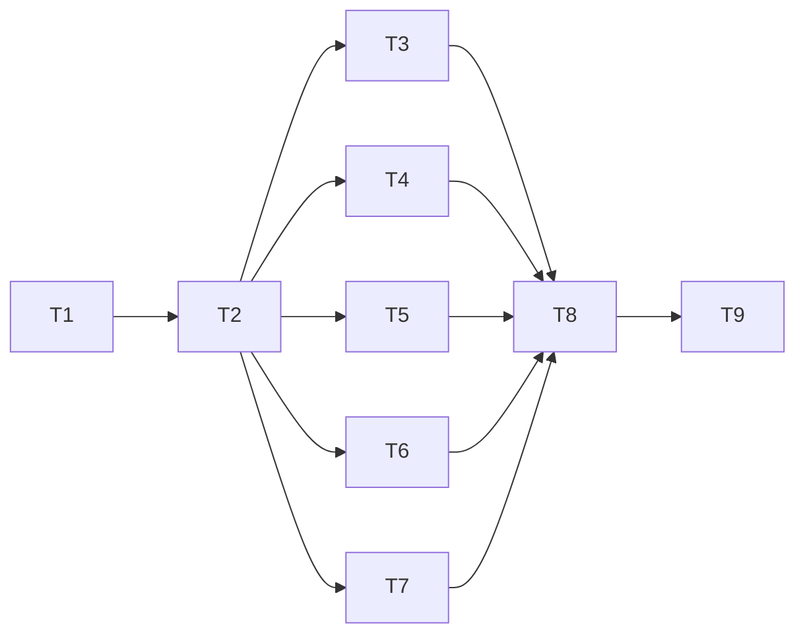
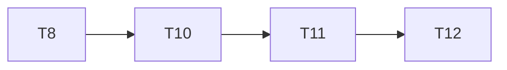

# TypeScript migration

The Python reference is `../project-board` at `a02cd9d310284868123dfd945daa1c2be9dc959c`, published in `mgd34msu/vibecheck-python`. This repository is `mgd34msu/vibecheck`.

The root agent owns this plan and graph. Existing behavior, database format, and both native plugins are migration requirements.

| Task | Dependencies       | Deliverable                                                       | State          |
| ---- | ------------------ | ----------------------------------------------------------------- | -------------- |
| T1   | —                  | Trace behavior and prove Bun/Node runtime choices                 | Complete       |
| T2   | T1                 | Strict scaffold, schema-derived domain types, shared contracts    | Complete       |
| T3   | T2                 | Native SQLite adapters, transactions, event and retry storage     | Complete       |
| T4   | T2                 | Session, plan, and work mutations                                 | Complete       |
| T5   | T2                 | Compact status, historical plans, deltas, and work history        | Complete       |
| T6   | T2                 | Typed dispatch, MCP, and CLI on both runtimes                     | Complete       |
| T7   | T2                 | Behavioral fixtures, tests, plugins, packaging, and documentation | Complete       |
| T8   | T3, T4, T5, T6, T7 | Combined verification and independent review                      | Complete       |
| T9   | T8                 | Final migration handoff and authorized publication                | Release v1.0.0 |

## Completion audit follow-up

The final completion audit found that consecutive coordinator corrections within one millisecond could omit the actor's historical session context. Release v1.0.0 remains immutable. The correction ships as v1.0.1.

| Task | Dependencies | Deliverable                                                                                | State          |
| ---- | ------------ | ------------------------------------------------------------------------------------------ | -------------- |
| T10  | T8           | Capture actors independently of heartbeat timing and add deterministic regression coverage | Complete       |
| T11  | T10          | Independent confirmation and complete Bun, Node, and native plugin verification            | Complete       |
| T12  | T11          | Publish and verify the v1.0.1 patch release                                                | Release v1.0.1 |

## Architecture contract

- ESM TypeScript targets ES2023 with NodeNext resolution. Relative imports use `.js` so emitted JavaScript runs directly. Bun runs the TypeScript sources.
- Use Zod-derived record and request types. Identifiers are branded through schemas. Action and event types are discriminated unions. Boundary input is `unknown`; domain data has concrete types. Authored code has no assertions, `any`, non-null assertions, or suppression comments.
- Input schemas preserve omitted fields, including nested location fields. Handlers apply defaults. Retry digests use canonical JSON of validated, supplied input so omitted fields remain distinct from explicitly supplied defaults.
- `schemas.ts` and `errors.ts` own domain contracts. `sqlite.ts` adapts native `bun:sqlite` and `node:sqlite`. `db.ts` owns storage. `mutations.ts`, `plans.ts`, and `queries.ts` own business behavior. `board.ts` parses and dispatches calls. `server.ts` and `cli.ts` own transport boundaries.
- `Database(path)` initializes lazily. `read(projectId, callback)` and `write(projectId, callback)` return promises; callbacks run synchronously inside one SQLite transaction. Acquisition retries asynchronously, so another same-process holder can release its lock.
- `Transaction` exposes explicit typed get/find/all/put methods for project, session, task, and work. `actorId` is a session ID or undefined until join establishes it. Retry actor keys are separate strings. Generic SQL reads require a row schema. Immutable changes capture session ancestry and historical identity context.
- Preserve SQLite schema version 1 and existing record/event shapes, including absent legacy `integration_required`, `supersedes`, and acknowledgment fields. Legacy work integration inference remains intact.
- `Board.call` is asynchronous and has concrete literal-tool overloads, with a union implementation. Successful writes return their original typed result plus cursor, plan revision, and map hint. The nine tool names and nested MCP `request` input remain unchanged.
- Use the current official MCP SDK v2 server and Node transport packages. Stdio and authenticated HTTP must work on Bun and Node. HTTP preserves token and Host safeguards.
- Native Codex and Claude manifests share a skill and a TypeScript/compiled-JavaScript launcher. Plugin artifacts include everything needed to start without a Python installation. Keep runtime databases outside plugin caches.
- Tests use `node:test` and `node:assert/strict` so the same cases run through Bun and emitted JavaScript on Node. Verification includes direct API behavior, concurrency, real MCP clients, extracted packages, and native host validation.

Two type designs were compared: schema-derived records with focused unions, and fully discriminated work-state objects with legacy adapters. The first keeps public and historical records stable without multiplying transition adapters. Two SQLite designs were tested: native runtime adapters and libSQL. Native adapters preserve the database format with fewer dependencies and lower measured transaction overhead.
